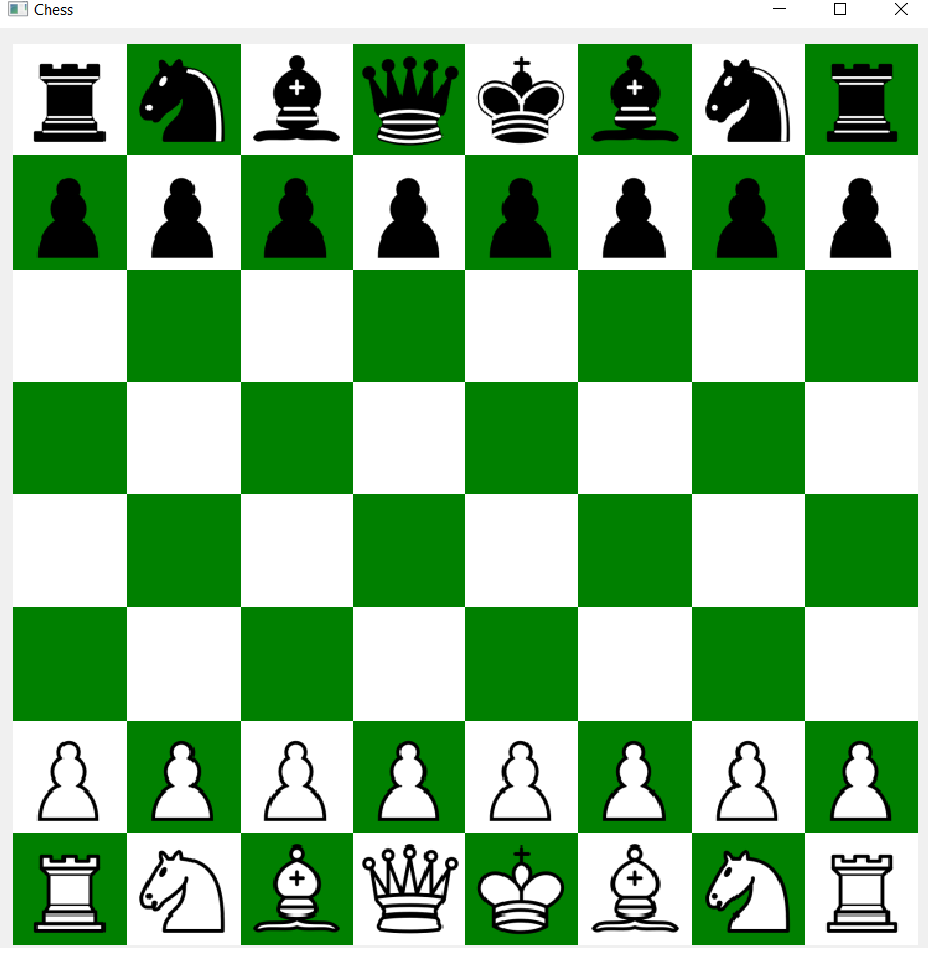

#Chees game QT

This is implementation of chess game. 

It provides:
- checking if move is legal
- undoing moves
- generating all possible moves
- respects all game rules expect of draw by repetition
- min-max bot calculating 3 moves ahead
- gui with drag and drop interface
- two players mode, choose of board orientation

TODO:

- optimization of engine
    - considering different way of storing pieces
    - template version of checking legity of move for each piece and color
- Chessboard configuration
    - Format of storing chessboard configuration
    - Loading and saving chessboard configuration
    - Hashing of chessboard configuration
- Draw by repetition using stored in unordered map configurations
- Ai
    - Alfa-beta prunning
    - Rejecting permutations
    - Playing known openins

